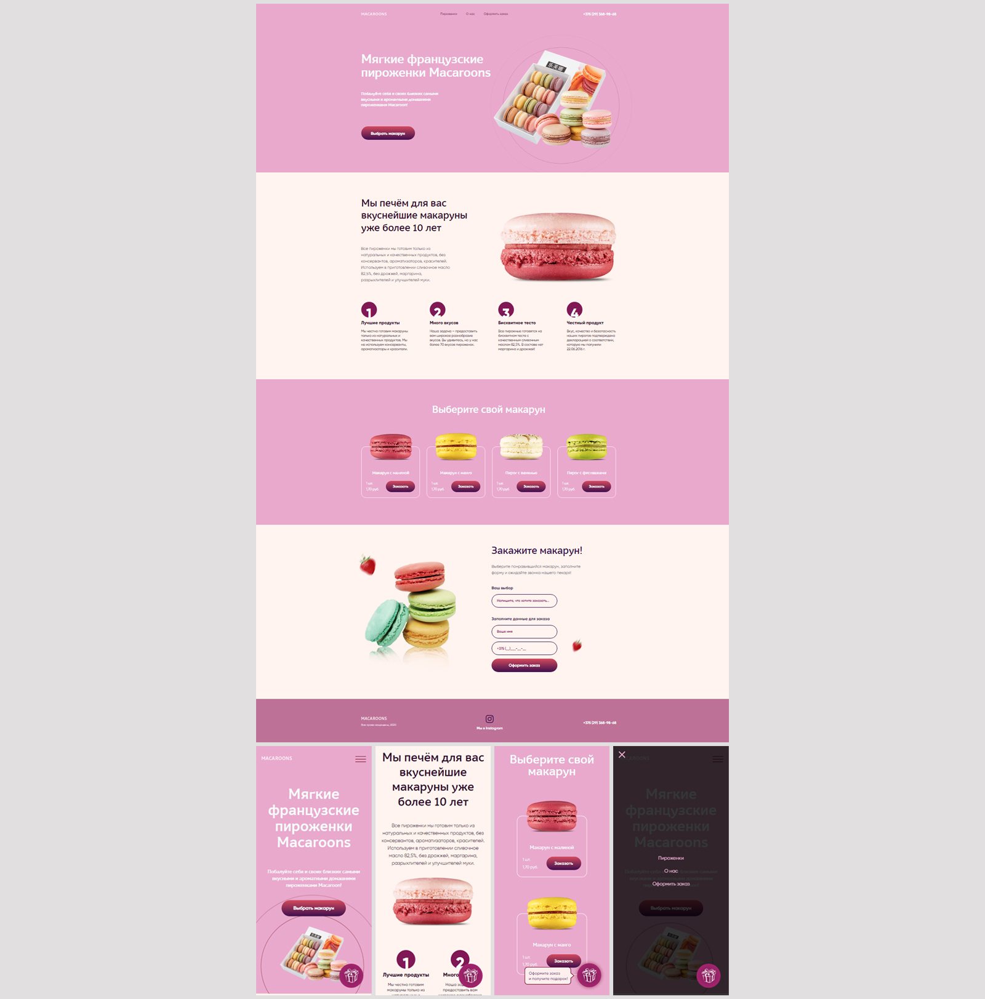

# Лендинг магазина французской выпечки

Вёрстка лендинга для магазина французской выпечки  
**Год:** 2022

## Внешний вид

## Реализовано:
- Вёрстка адаптивной веб-страницы по макету;
- Адаптив (от 329px);
- Стилизация с помощью CSS (псевдоклассы, Flexbox, Grid Layout);
- Добавление CSS-анимаций;
- Функционал валидации формы, реализация "бургер-меню" для адаптивной версии страницы.

## Используемые технологии:
* HTML
* CSS (Less)
* JavaScript
* jQuery
* Gulp / Grunt